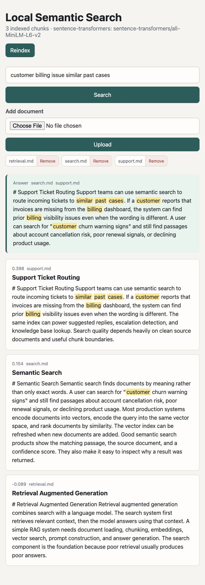
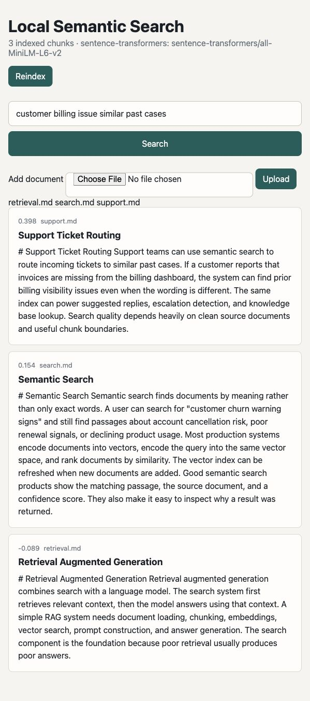

# Local Semantic Search

A local semantic search engine for Markdown, PDF, text, and reStructuredText documents. It includes a CLI, a FastAPI web UI, document upload/delete controls, highlighted results, and a local extractive answer panel.



## Features

- Load `.md`, `.pdf`, `.txt`, and `.rst` documents
- Split documents into searchable chunks
- Use transformer embeddings with Sentence Transformers
- Fall back to hashed word/character n-gram embeddings without model downloads
- Persist a local JSON index
- Search from the CLI
- Search from the browser
- Upload documents from the browser
- Delete documents and reindex automatically
- Highlight query terms in results
- Generate a local extractive answer from top results

## Setup

```bash
python3 -m venv .venv
source .venv/bin/activate
pip install -e .
```

For higher quality transformer embeddings:

```bash
pip install -e '.[transformers]'
```

By default, the indexer uses `sentence-transformers/all-MiniLM-L6-v2` when Sentence Transformers is installed. If that optional dependency is missing, it falls back to the dependency-light hashing embedder.

## Quick Commands

```bash
make install-dev
make index
make run
make test
```

## Build The Index

```bash
semantic-search build docs
```

Force transformer embeddings:

```bash
semantic-search build docs --backend transformer
```

Use the lightweight fallback explicitly:

```bash
semantic-search build docs --backend hashing
```

## Search From The CLI

```bash
semantic-search search "how do I answer questions over documents?"
```

## Run The Web App

```bash
uvicorn semantic_search.app:app --reload
```

Open:

```text
http://127.0.0.1:8000
```

## Run With Docker

```bash
docker compose up --build
```

The Docker image builds the sample index with the lightweight hashing backend. For transformer embeddings, run the Python setup locally and build the index with `--backend transformer`.

## Manage Documents



Put `.md`, `.pdf`, `.txt`, or `.rst` files in `docs/`, then run:

```bash
semantic-search build docs
```

You can also upload files directly from the web UI. Uploaded documents are saved into `docs/` and indexed immediately.

Use the `Remove` button beside a document in the web UI to delete it and rebuild the index.

## Run Tests

```bash
pip install -e '.[dev]'
pytest
```

## Project Layout

```text
semantic_search/
  app.py         FastAPI routes and UI view models
  cli.py         command-line interface
  documents.py   document loading and chunking
  embedding.py   hashing and transformer embedders
  index.py       index persistence and search
web/
  templates/     Jinja templates
  static/        CSS
docs/            local documents to index
data/            generated index files
tests/           pytest coverage
```

## License

MIT
